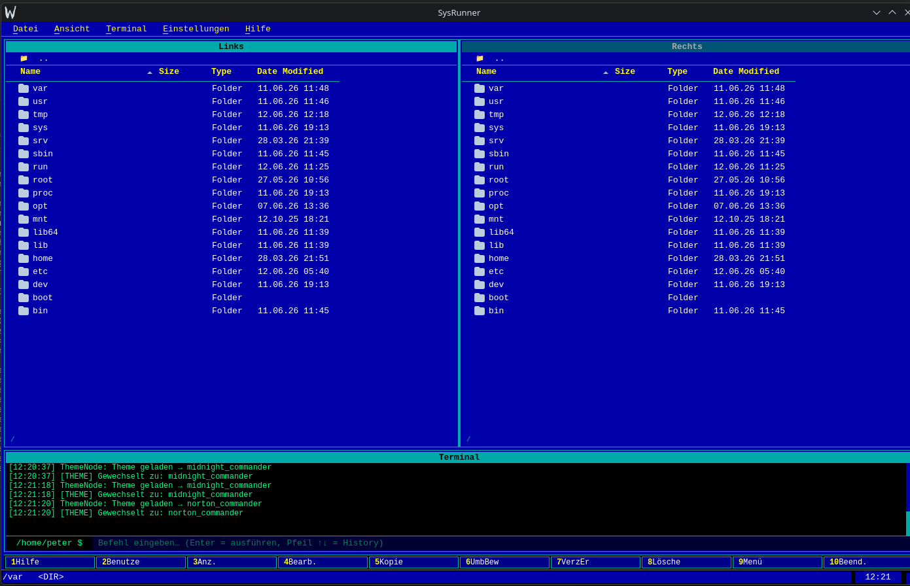
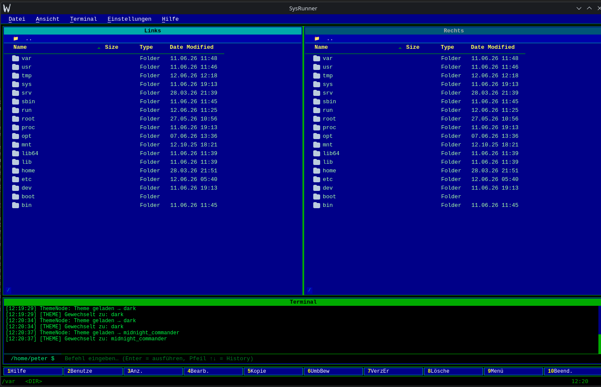
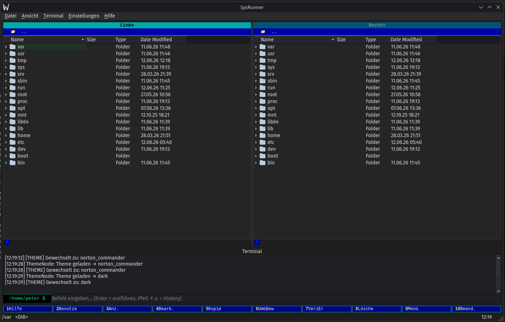

# SysRunner

> Norton-Commander-Style Dateimanager für Linux — zwei Panels, integriertes Terminal, F-Tasten Navigation. Weil der NC nie wirklich weg war. 😄

Ein moderner Dateimanager im klassischen Dual-Panel-Stil, gebaut mit Python und Qt. Drei Themes, integriertes Terminal, und ein Node-System für Datei-, Docker- und Datenbankoperationen.

---

## Screenshots

### Norton Commander Theme


### Midnight Commander Theme


### Dark Theme


---

## Features

- **Dual-Panel Navigation** — Links/Rechts wie der klassische NC
- **Integriertes Terminal** — direkt im Fenster, kein Wechsel nötig
- **F-Tasten Bedienung** — F1 Hilfe, F2 Benutze, F3 Anz., F4 Bearb., F5 Kopie, F6 UmbBew, F7 VerzEr, F8 Lösche, F9 Menü, F10 Beend.
- **3 Themes** — Norton Commander, Midnight Commander, Dark
- **Node-System** — modulare Architektur für verschiedene Operationen

## Node-System

| Node | Funktion |
|------|----------|
| `fs_node` | Datei- und Verzeichnisoperationen |
| `docker_node` | Docker Container Management |
| `db_node` | Datenbankoperationen |
| `runner_node` | Prozesse und Tasks ausführen |
| `theme_node` | Theme-Verwaltung |

---

## Stack

- **Python 3.14**
- **Qt** (PyQt/PySide)
- **QSS** für Themes
- **SQLite** für lokale Datenhaltung

---

## Setup

```bash
# Dependencies installieren
pip install -r requirements.txt

# Starten
python qt_main.py
```

---

## Struktur

```
SysRunner/
├── core/          # Events, Logging, Registry, Tasks
├── nodes/         # fs, docker, db, runner, theme
├── ui/
│   ├── main_window.py
│   └── themes/    # norton_commander.qss, midnight_commander.qss, dark.qss
├── qt_main.py     # Einstiegspunkt
└── requirements.txt
```

---

## Autor

**Peter Päffgen** — [paeffgen-it.de](https://paeffgen-it.de) · [GitHub](https://github.com/peter1965p)
